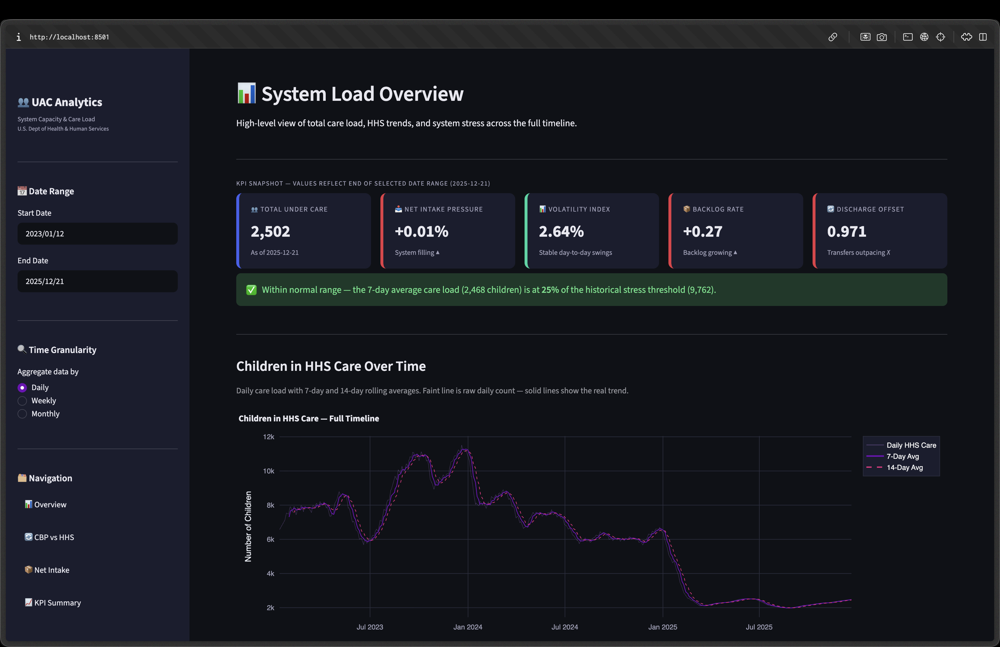
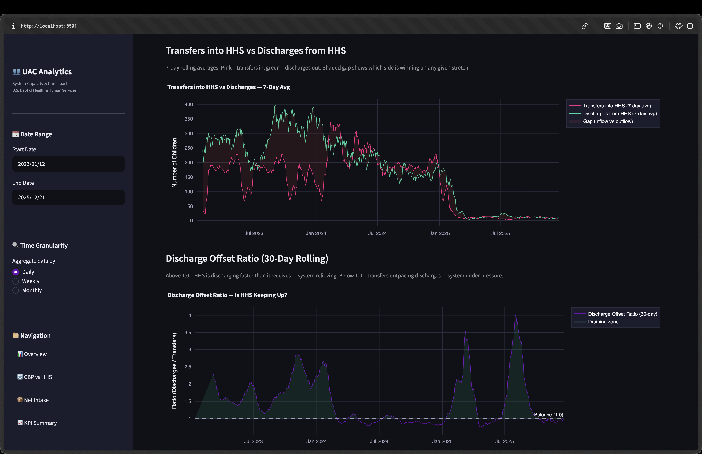
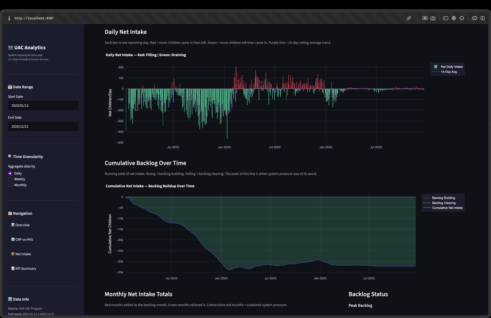
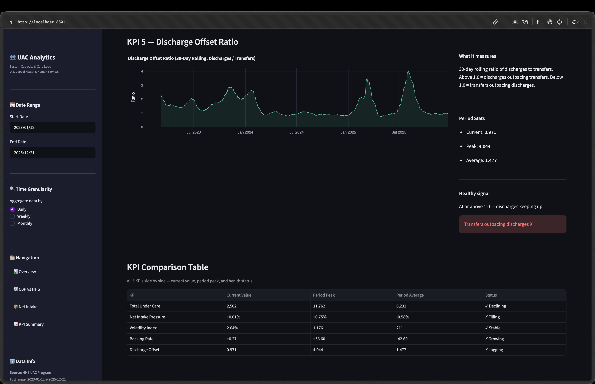

# System Capacity & Care Load Analytics for Unaccompanied Children (2023–2025)

A data analytics project on HHS's Unaccompanied Alien Children (UAC) program — tracking care load trends, stress periods, and discharge dynamics across 720 reporting days from January 2023 to December 2025.

**Deliverables:** Jupyter EDA pipeline · Streamlit dashboard · Research paper

---

## Project Structure

```
uac_analytics/
├── data/
│   ├── HHS_Unaccompanied_Alien_Children_Program.csv   # Raw HHS source data
│   ├── uac_cleaned.csv                                # Output of 01_data_prep.ipynb
│   └── uac_enriched.csv                               # Output of 02_eda.ipynb (used by dashboard)
│
├── notebooks/
│   ├── 01_data_prep.ipynb                             # Phase 1 — cleaning & feature engineering
│   └── 02_eda.ipynb                                   # Phase 2 — full EDA (7 sections)
│
├── outputs/
│   ├── charts/                                        # Saved chart images (.png), one set per EDA section
│   └── reports/                                       # JSON/text summaries generated by the EDA notebook
│       ├── kpi_snapshot.json                          # KPI values as of the latest date
│       ├── dataset_summary.json
│       ├── trend_summary.json
│       ├── flow_summary.json
│       ├── stress_summary.json
│       ├── intake_summary.json
│       ├── seasonality_summary.json
│       ├── executive_summary.pdf
│       └── eda_findings_report.txt                    # Auto-generated findings write-up
│
├── dashboard/
│   ├── .streamlit/config.toml                         # Dark theme configuration
│   ├── app.py                                         # Entry point
│   ├── utils/data_loader.py                           # Cached data loading + KPI helpers
│   ├── components/
│   │   ├── kpi_cards.py                               # KPI card components
│   │   └── charts.py                                  # Plotly chart functions
│   └── views/
│       ├── overview.py                                # Page 1 — system overview
│       ├── cbp_hhs.py                                 # Page 2 — CBP vs HHS flow
│       ├── net_intake.py                              # Page 3 — net intake & backlog
│       └── kpi_summary.py                             # Page 4 — full KPI timeline
│
├── screenshots/                                       # Dashboard screenshots used in this README
├── main.py                                            # Placeholder entry point (not part of the pipeline)
├── test_setup.py                                      # Quick check that core dependencies import correctly
├── pyproject.toml / uv.lock                           # Dependency manifest (uv)
└── README.md
```

---

## Setup

Requires Python 3.12+. Pick whichever tool you're already using — both land in the same place.

### Option A: uv (recommended)

This project uses [uv](https://docs.astral.sh/uv/) for dependency management, with a lockfile (`uv.lock`) committed so installs are reproducible.

```bash
# install uv if you don't have it
curl -LsSf https://astral.sh/uv/install.sh | sh

# create the environment and install from the lockfile
uv sync
```

Activate the environment `uv sync` creates:

```bash
source .venv/bin/activate        # macOS/Linux
.venv\Scripts\activate           # Windows
```

### Option B: pip

No uv required — a plain virtualenv works too.

```bash
python3 -m venv .venv
source .venv/bin/activate        # macOS/Linux
.venv\Scripts\activate           # Windows

pip install pandas jupyter notebook matplotlib plotly streamlit openpyxl
```

### Sanity check

Either way, confirm everything's wired up:

```bash
python test_setup.py
```

---

## Running the Notebooks

Run both notebooks in order — each one writes its output to `data/` for the next step to pick up.

### Phase 1 — Data Preparation

```bash
jupyter notebook notebooks/01_data_prep.ipynb
```

**What it does:**

- Loads the raw HHS CSV and renames columns to clean snake_case names
- Drops 450 blank trailing rows
- Parses inconsistent date formats using `format="mixed"`
- Converts `hhs_care` from a comma-formatted string to an integer
- Engineers derived columns: `total_system_load`, `net_daily_intake`, `hhs_growth_rate_pct`, `hhs_care_7day_avg`, `hhs_care_14day_avg`, `cumulative_net_intake`
- Saves the result to `data/uac_cleaned.csv`

**Input:** `data/HHS_Unaccompanied_Alien_Children_Program.csv`
**Output:** `data/uac_cleaned.csv`

---

### Phase 2 — Exploratory Data Analysis

```bash
jupyter notebook notebooks/02_eda.ipynb
```

**What it does (7 sections):**

| Section | Title                           | Charts                                                                         |
| ------- | ------------------------------- | ------------------------------------------------------------------------------ |
| 1       | Trend Analysis                  | Care load trend, 7/14/30-day rolling averages, YoY comparison, growth rate     |
| 2       | CBP vs HHS Comparison           | Transfers vs discharges, offset ratio, scatter correlation                     |
| 3       | Stress & Pressure Periods       | Stress zone highlight, sustained windows, volatility index                     |
| 4       | Net Intake & Backlog            | Daily net intake, cumulative backlog, monthly totals, distribution             |
| 5       | Seasonality & Temporal Patterns | YoY monthly lines, box plot by month, quarterly bar chart                      |
| 6       | KPI Computation                 | Computes all 5 KPIs, saves `kpi_snapshot.json`                                 |
| 7       | Final EDA Summary               | Prints findings report, saves `uac_enriched.csv` and `eda_findings_report.txt` |

**Input:** `data/uac_cleaned.csv`
**Output:** `data/uac_enriched.csv`, `outputs/reports/*.json`, `outputs/reports/eda_findings_report.txt`, `outputs/charts/*.png`

> **Note:** Run all cells top to bottom — the KPI section depends on columns derived earlier in the notebook.

---

## Running the Dashboard

The dashboard reads from `data/uac_enriched.csv`, so make sure `02_eda.ipynb` has been run at least once first.

```bash
cd dashboard
streamlit run app.py
```

The app opens at `http://localhost:8501`

### Dashboard Pages

| Page                     | Description                                                           |
| ------------------------ | --------------------------------------------------------------------- |
| **Overview**             | 5 KPI cards, HHS care load trend, stress zone chart, monthly averages |
| **CBP vs HHS Flow**      | Transfer and discharge trends, offset ratio, scatter correlation      |
| **Net Intake & Backlog** | Daily net intake, cumulative backlog, monthly totals                  |
| **KPI Summary**          | Full timeline for all 5 KPIs, comparison table, health score          |

### Sidebar Controls

- **Date range** — filter all charts to a custom window
- **Granularity** — switch between Daily, Weekly, and Monthly views
- **Page navigation** — buttons to move between the four views; the active page is highlighted

### Screenshots

**Overview** — KPI cards, the early-warning banner, and the HHS care trend chart.



**CBP vs HHS Flow** — transfers vs discharges and the discharge offset ratio.



**Net Intake & Backlog** — daily net intake and cumulative backlog buildup.



**KPI Summary** — per-KPI detail plus the full 5-KPI comparison table.



---

## Key Findings

| Metric                                | Value                                 |
| ------------------------------------- | ------------------------------------- |
| Peak HHS care load                    | 11,516 children (Dec 20, 2023)        |
| End-of-period care load               | 2,484 children (Dec 21, 2025)         |
| Decline from peak                     | 78.4%                                 |
| High-stress days (90th pct threshold) | 73 of 720 (10.1%)                     |
| Average discharge offset ratio        | 1.477 (discharges outpaced transfers) |
| Average net daily intake              | −44.7 children/day                    |
| Highest-load month (all years)        | January (avg 6,990)                   |

> The 1.477 figure is a 30-day sum-based average (KPI 5), which smooths out a handful of near-zero-transfer days that otherwise spike the ratio. A naive day-by-day average of the raw ratio comes out to 2.014 — both are "correct," they just answer slightly different questions, so don't be surprised if you see 2.014 quoted elsewhere (e.g. `eda_findings_report.txt`).

---

## Data Source

**HHS Unaccompanied Alien Children Program**
Published by the U.S. Department of Health and Human Services, Office of Refugee Resettlement.
https://www.hhs.gov/programs/social-services/unaccompanied-alien-children/index.html

Raw file: `data/HHS_Unaccompanied_Alien_Children_Program.csv`
720 valid rows · Jan 12, 2023 – Dec 21, 2025 · 6 columns after cleaning

---

## Notes

- `pandas` 3.x uses `str` dtype (not `object`) for string columns — the data prep notebook already accounts for this.
- Chart images in `outputs/charts/` are numbered to match the section they came from in `02_eda.ipynb`.
- The dashboard caches data with `@st.cache_data` — restart the app after regenerating `uac_enriched.csv` so it picks up the change.
- If you install via pip instead of `uv sync`, package versions aren't pinned to the lockfile — results should still match, but exact library versions may differ slightly.

